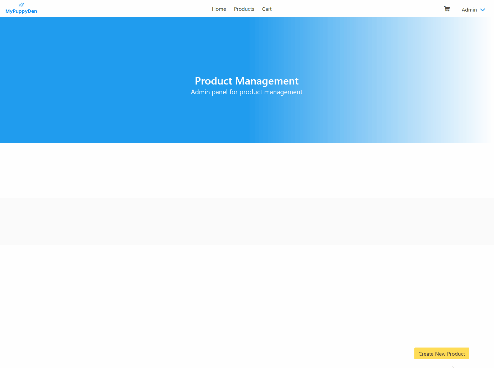

# Laravel E-shop
  A simple application that started as an attempt to create an e-shop without the use of CMS

## Current functionality
  1. Product CRUD with input verifications on both front and back-ends
  2. User authentication system with different types of permissions
  3. Image manipulation with PHP

# Available at
  https://mypuppyden.herokuapp.com

# Product CRUD demo

